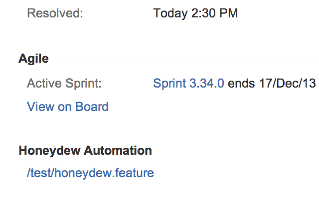

# Honeydew x JIRA chrome extension

Adds a sidebar indicating what honeydew features cover the current
test.

### implementation

We hit an endpoint at

    https://{{ hostname }}/rest.php/features/tree?needle={{ query }}

which should return a JSON object with a array of matched features in
a key called list:

    { "success": true, "list": [] }

We parse the list into links back to the Honeydew element and append
it to the DOM in the prope rposition.

### packaging

    cd extension && zip -r Archive.zip .

Upload the archived files in the chrome developer dashboard.

### config

Put the proper hostname of the remote box in
[extension/src/inject/auth.js](extension/src/inject/auth.js).
